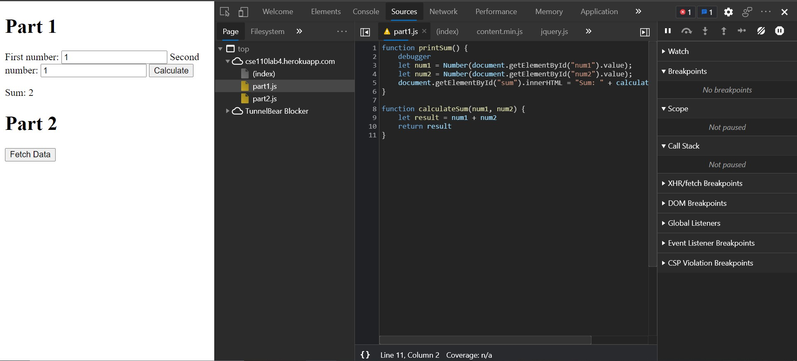

1. The `calculateSum` function is taking in string values and not numbers.
2. 
3. `citylots.json`
4.  `part2.js:2`
5. `11687628 bytes`
6. `80.54 ms`
7. `Mozilla/5.0 (Windows NT 10.0; Win64; x64) AppleWebKit/537.36 (KHTML, like Gecko) Chrome/90.0.4430.85 Safari/537.36 Edg/90.0.818.46`
8. `Apache`
9. `Tue, 26 Jan 2021 22:14:13 GMT`
10. `application/json`
11. `fetchData`

